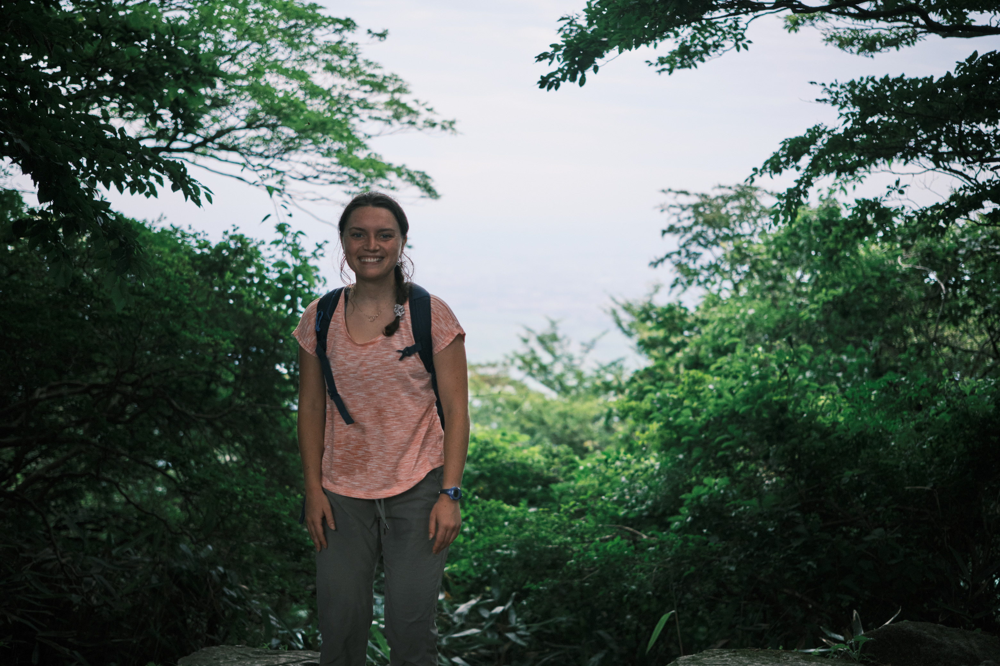

## Hello! Welcome to my website!

---

## My research

I am a second year Master's student at the University of New Hampshire in the [Water Quality Analysis Laboratory](https://wrrc.unh.edu/unh-water-quality-analysis-laboratory-0) run by Dr. Bill McDowell. I am interested in how climate change and corresponding weather events are affecting stream biogeochemsitry. My research focuses on leaf litter leachate patterns emerging due to severe climatic events in tropical ecosystems and how this leachate may play a role in the metabolic regimes of freshwater systems. I use large datasets primarily from in-situ sensors and perform time series and multivariate data analysis. 

---

## Biography

I was born and raised in Baltimore, MD, but recieved my bachelor's degree from the University of Wisconsin, Madison. After spending four years loving living in Wisconsin and graduating in the peak of the covid pandemic, I decided to convert the back of an old SUV with one of my best friends and travel the country for four months camping in various National Forests. After that, I spent a year in Montana working for a small watershed group as part of the Big Sky Watershed Corps, which is an Individual Placement Program within the Montana Conservation Corps. After a year of hiking, backpacking, conducting surface water sampling in lakes and streams, and seeing multiple bears, I moved to Stowe, VT to work at the ski resort as a Guest Services attendant. Once the New England ski season came to an end, I wasn't ready to stop skiing and roadtripped to Mt Hood in Oregon to ski and camp for another month. By then, I was ready to go back to living in one place for more than a year, and I moved to New Hampshire to start graduate school at UNH. While not doing school and science, I can be found hiking in the White Mountains, reading, cooking new recipes, and exploring new coastal towns in the area.

